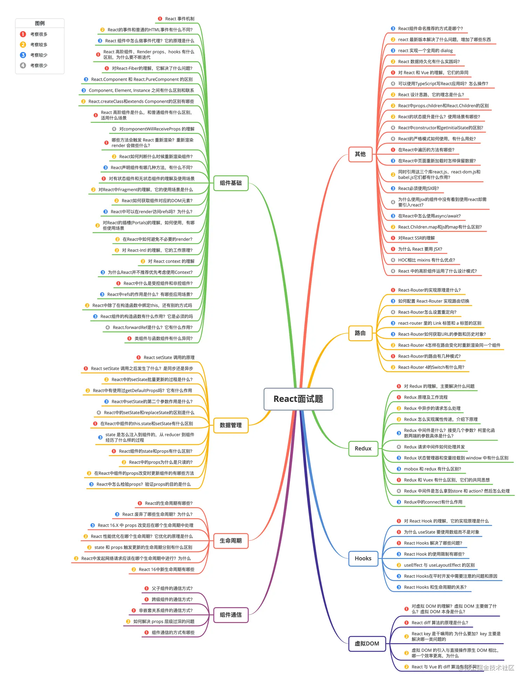

#####  React,哪一个版本有hooks,怎么进行数据通信
[https://www.jb51.net/javascript/319691ri6.htm#_label2](https://www.jb51.net/javascript/319691ri6.htm#_)

#####  useMemo 和 useCallback 有什么区别
[useMemo和useCallback的区别](https://www.cnblogs.com/1024L/p/17075974.html)

#####  useEffect 和 useLayoutEffect 有什么区别
[useEffect 与 useLayoutEffect区别](https://www.jianshu.com/p/ec29aa26f740)

#####  React生命周期
[生命周期](https://projects.wojtekmaj.pl/react-lifecycle-methods-diagram/)
[react的 (新/旧) 生命周期（重点）](https://blog.csdn.net/qq_41579104/article/details/130489046)

#####  React类组件函数组件区别
[React的类组件与函数组件](https://zhuanlan.zhihu.com/p/653460854)

#####  Hooks 的出现是为了解决什么问题？函数式组件有什么好处？

#####  使用过哪些 hooks？

#####  React 的 [[React diff]] 算法，具体讲讲比较子树的时候用到广度还是深度优先

#####  react 框架有什么特点

#####  了解过React的数据流吗？redux， redux 的底层运行机制是怎么样的? redux的state改变，而不是用新的数据，会不会发生变化
[Redux入门教程（快速上手）](https://segmentfault.com/a/1190000011474522)

#####  react18新特性

#####  usememo和react.memo的区别

#####  react的HOC

#####  react的批量渲染是怎么实现的? react的渲染原理?

#####  如何监控react组件是否有重复渲染

#####  react组件间通信

#####  react事件和dom原生事件区别？react的事件机制合成事件的机制
[事件处理](https://weread.qq.com/web/reader/81b326407198d71881ba331k6f4322302126f4922f45dec?)

#####  react16以后fiber架构流程 

#####  react的redux的数据流
[通俗易懂的redux原理](https://juejin.cn/post/6863760642092826637)

#####  useState和useReducer的区别
[useReducer 和 useState 的区别是？](https://www.nowcoder.com/discuss/513987747963531264)

#####  react hooks 有哪些优缺点？
[React hooks的优缺点详解](https://www.jb51.net/article/210661.htm#_lab2_2_0)

##### redux主要解决了什么问题？它的工作原理是什么？与mobx的区别是什么？你觉得redux 和 mobx哪个更好？
[Redux解决了什么问题？](https://blog.csdn.net/qq_36538012/article/details/134027836)
[Redux原理分析以及使用详解（TS && JS)](https://cloud.tencent.com/developer/article/1905774)
[Redux与MobX比较](https://weread.qq.com/web/reader/81b326407198d71881ba331kd1f32d7024fd1fe173d0651?)

##### react中state有层级很深，比如a.b.c.d，如果只更新c属性有哪些办法？immutable.js实现的原理是什么？
[3．状态的类型是普通对象（不包含字符串、数组）](https://weread.qq.com/web/reader/81b326407198d71881ba331k6ea321b021d6ea9ab1ba605?)

#####  react为什么调用setState而不是直接改变state
[react为什么调用setState而不是直接改变state](https://blog.csdn.net/m0_72603435/article/details/130452385)
[为什么调用setState而不是直接改变state](https://blog.csdn.net/qq_68299987/article/details/134498311)
[setState 函数做了哪些事情](https://bjcp.itcast.cn/news/20230508/16453389770.shtml)

##### 函数组件重新渲染的时候怎么拿到useState之前的状态，而不是得到初始化的状态
[React 如何获取上一个 State 的值？](https://blog.csdn.net/weixin_42650595/article/details/131857232)

