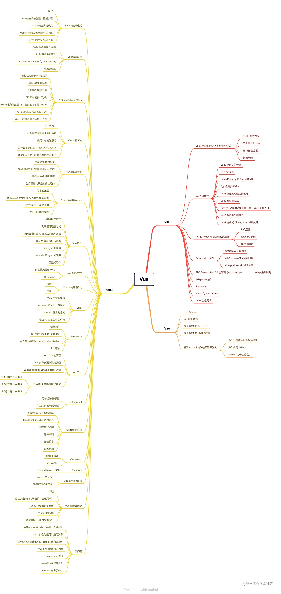

### 1. [「2022」寒冬下我的面试知识点复盘【Vue3、Vue2、Vite】篇](https://juejin.cn/post/7166446028266733581)

### setup
[setup](https://blog.csdn.net/qq_40340943/article/details/124381843)
[12.5　setup 函数的作用与实现](https://weread.qq.com/web/reader/c5c32170813ab7177g0181aek98f3284021498f137082c2e?)

### 组合式 API (Composition API) 好处？
[组合式 API 常见问答](https://cn.vuejs.org/guide/extras/composition-api-faq.html)

### 单文件组件中的组合式 API 语法糖 <script setup>
[<script setup>](https://cn.vuejs.org/api/sfc-script-setup.html)

### Teleport 组件
[Teleport 组件](https://cn.vuejs.org/guide/built-ins/teleport.html)
[14.2　Teleport 组件的实现原理](https://weread.qq.com/web/reader/c5c32170813ab7177g0181aekb6d32b90216b6d767d2f0dc?)

### vue3生命周期
[Vue 3 生命周期完整指南](https://segmentfault.com/a/1190000039680245)

### 2. [最全的 Vue 面试题+详解答案](https://www.cnblogs.com/wenshaochang123/p/14888494.html)

### 3. [vue 高频面试题（2023）](https://blog.csdn.net/jiang7701037/article/details/134700415)

### 4. [出一个 vue 的场景题，写一个垂直居中的弹窗，希望不是通过组件注入的方式，而是要用的时候才创建这个弹窗；创建的方式是通过 createDialog 的形式；（是通过 vue.extend)](https://blog.csdn.net/qq_63358859/article/details/125442312)

### 5. [双向绑定原理](https://blog.csdn.net/qq_63358859/article/details/125442312)

### 6. [Object.definePropoty](https://blog.csdn.net/qq_63358859/article/details/125442312)

### 7. [vue 写组件的时候，怎么做渲染优化](https://www.baidu.com/s?ie=utf-8&f=8&rsv_bp=1&tn=baidu&wd=vue%E5%86%99%E7%BB%84%E4%BB%B6%E7%9A%84%E6%97%B6%E5%80%99%EF%BC%8C%E6%80%8E%E4%B9%88%E5%81%9A%E6%B8%B2%E6%9F%93%E4%BC%98%E5%8C%96&oq=%25E5%2586%2599%25E7%25BB%2584%25E4%25BB%25B6%25E7%259A%2584%25E6%2597%25B6%25E5%2580%2599%252C%25E6%2580%258E%25E4%25B9%2588%25E5%2581%259A%25E6%25B8%25B2%25E6%259F%2593%25E4%25BC%2598%25E5%258C%2596&rsv_pq=e377bb1f00045885&rsv_t=ffd154hYY%2FPMeaEyBjfUKIYuA0FNUFWtvno0vh37QlucPYoG9qtwujWNyPY&rqlang=cn&rsv_dl=tb&rsv_enter=1&rsv_btype=t&inputT=540&rsv_sug3=9&rsv_sug1=7&rsv_sug7=100&rsv_sug2=0&rsv_sug4=1292)

####  MVVM MVC MVP
[MVC 和 MVVM 的区别 ](https://www.cnblogs.com/luckest/p/16917400.html)
[MVC，MVP 和 MVVM 的图示](https://www.ruanyifeng.com/blog/2015/02/mvcmvp_mvvm.html)
[MVC、MVP、MVVM模型](https://www.cnblogs.com/keyng/p/12920183.html)

React 和 Vue 的区别如下：

#### 监听数据变化的实现原理不同

Vue 通过 getter/setter 以及一些函数的劫持，能精确知道数据变化，不需要特别的优化就能达到很好的性能。React 默认是通过比较引用的方式进行的，当应用的状态被改变时，全部子组件都会重新渲染，可能导致大量不必要的 VDOM 的重新渲染，需要通过 PureComponent/shouldComponentUpdate 这个生命周期方法来进行控制。

#### 数据流的不同

Vue 默认支持双向数据绑定。但 React 一直提倡的是单向数据流，称之为 onChange/setState()模式。

#### 框架本质不同

Vue 是 MVVM 模式的框架，由 MVC 发展而来，拥有视图层、模型层以及控制层。而 React 是前端组件化框架，是由后端组件化发展而来，React 只是一个视图层。

#### 组件写法不一样

React 推荐的做法是 JSX+inline style，也就是把 HTML 和 CSS 全都写进 JavaScript 了。Vue 则是把 HTML、CSS、JS 都整合在一个页面内。

#### 状态管理不同

Vue 使用 Vuex 进行状态管理，其数据是可变的。React 使用 Redux 进行状态管理，Redux 的数据是不可变的。

#### 学习曲线不同

React 学习曲线相对较陡，尤其是当引入数据流管理工具时，需要花费更多时间掌握。Vue 学习曲线相对较缓，API 设计更为直观，文档也非常友好，初学者可以更快上手。

#### [computed 的实现原理 ](https://weread.qq.com/web/reader/c5c32170813ab7177g0181aekd3d322001ad3d9446802347?)

#### [Vue 的整个实现原理](Vue的整个实现原理)

#### [Watch 的运行原理](https://weread.qq.com/web/reader/c5c32170813ab7177g0181aekd3d322001ad3d9446802347?)

#### [Vue 的数据为什么频繁变化但只会更新一次](https://blog.51cto.com/u_10887428/5148470)

#### [vue3 diff 算法的优化]

[vue3 diff 算法优化](https://blog.51cto.com/u_10887428/5148470)

#### [从:key 的角度，来看 Vue3 中 diff 算法的实现原理（多图详解）]
[vue3 diff 算法优化](https://blog.csdn.net/weixin_46163658/article/details/122563297)

#### [eventBus介绍,和vuex对比，优缺点]
[Vue事件总线（EventBus）使用指南：详细解析与实战应用](https://blog.csdn.net/shanghai597/article/details/130965196)

#### [【Vue】组件传值的六种方法]
[【Vue】组件传值的六种方法](https://www.cnblogs.com/liliuyu/p/13590853.html)

#### [vue的双向绑定缺点]
[vue双向数据绑定的缺点](https://localsite.baidu.com/okam/pages/article/index?articleId=20116233&ucid=n1DvP1c3nHf&categoryLv1=%E6%95%99%E8%82%B2%E5%9F%B9%E8%AE%AD&ch=54&srcid=10004)

#### [defineProperties缺点, 为什么使用proxy]
[关于Object.defineProperty 的基础知识](https://www.cnblogs.com/zjjDaily/p/11227623.html)
[https://blog.csdn.net/qq_38290251/article/details/135280017](https://blog.csdn.net/qq_38290251/article/details/135280017)

#### [proxy 会全部属性代理吗]
[什么是proxy](https://es6.ruanyifeng.com/#docs/proxy)
[为什么需要reflect]](https://es6.ruanyifeng.com/#docs/reflect)

#### 30 道 Vue 面试题，超详细（自测 Vue 掌握程度）
[30 道 Vue 面试题，超详细（自测 Vue 掌握程度）](https://zhuanlan.zhihu.com/p/644543319)

#### vue中nextTick的实现，结合浏览器事件循环机制说一下？
[vm.$nextTick](https://weread.qq.com/web/reader/f8632810723f0231f86d9aakb6d32b90216b6d767d2f0dc?)
[nextTick](https://ustbhuangyi.github.io/vue-analysis/v2/reactive/next-tick.html#vue-%E7%9A%84%E5%AE%9E%E7%8E%B0)
[Vue的异步更新策略]
[Vue.nextTick和vm.$nextTick区别](https://cn.vuejs.org/api/component-instance.html#nexttick)
[NextTick的版本迭代变化]

#### 一文彻底搞懂Vue中scoped和/deep/原理
[一文彻底搞懂Vue中scoped和/deep/原理](https://www.jb51.net/javascript/294585dol.htm#_label1)